# SOAR
# 🛡️ Hệ thống SOC/SOAR: Chuỗi Tấn Công Thực Chiến & Phản Ứng Tự Động

## 📖 Tổng quan dự án
Dự án giả lập toàn diện một cuộc tấn công mạng từ khâu xâm nhập (Initial Access), leo thang đặc quyền (Privilege Escalation), khai thác sâu (Post-Exploitation), cho đến khâu điều tra, xử lý sự cố (Incident Response) bằng Wazuh SIEM và tự động hóa quy trình phân tích mối đe dọa qua SOAR (Shuffle).

* **Hồ sơ kỹ thuật chi tiết (Step-by-step cấu hình):** Vui lòng xem file `SOC_SOAR.pdf` trong thư mục `docs/`.

---

## 🚀 Nội dung thực hiện theo các giai đoạn

<b>🛠️ GIAI ĐOẠN 1: DỰNG LAB & NGHIỆM THU ĐƯỜNG ỐNG GIÁM SÁT</b>

 

Xây dựng môi trường mạng Lab khép kín, cấu hình các Custom Rules trên Wazuh và tích hợp các Node chức năng trên Shuffle để đồng bộ dữ liệu về TheHive.

1. **Sơ đồ mạng tổng thể:**
   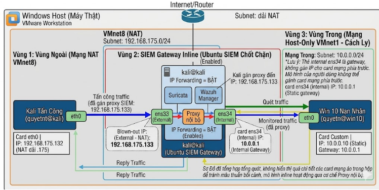
2. **Kích hoạt trạng thái Wazuh Agent thành công:**
   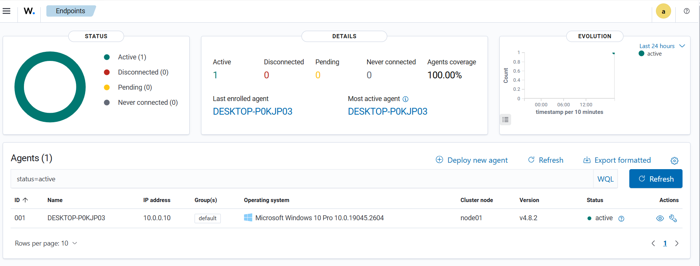
3. **Cấu hình Custom Rules trên Wazuh Manager:**
   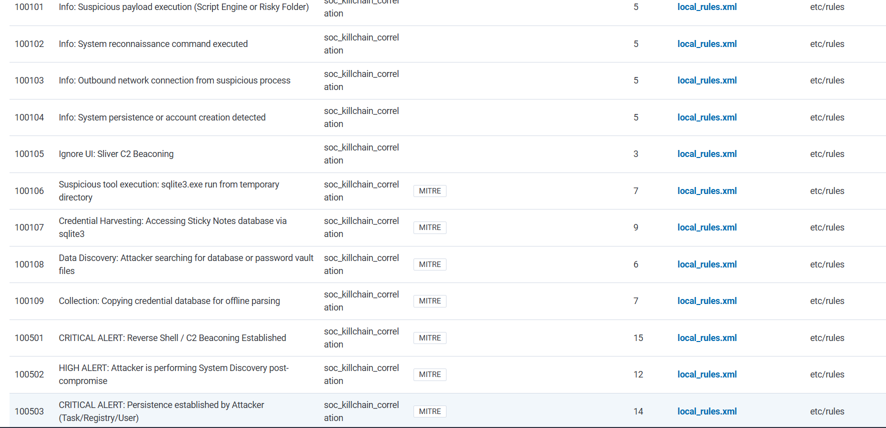
4. **Cảnh báo (Alert) kích nổ ban đầu trên Wazuh Dashboard:**
   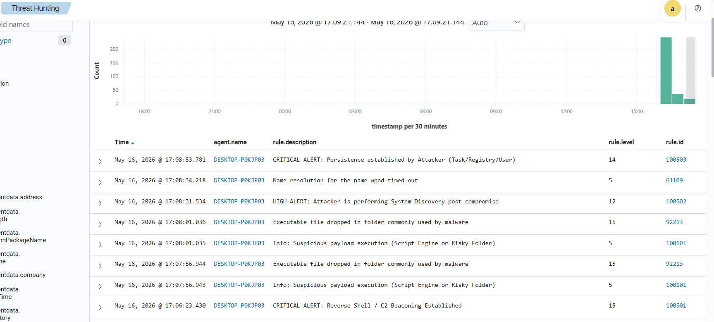
5. **Sơ đồ hoàn chỉnh các Node cấu hình trên Shuffle:**
   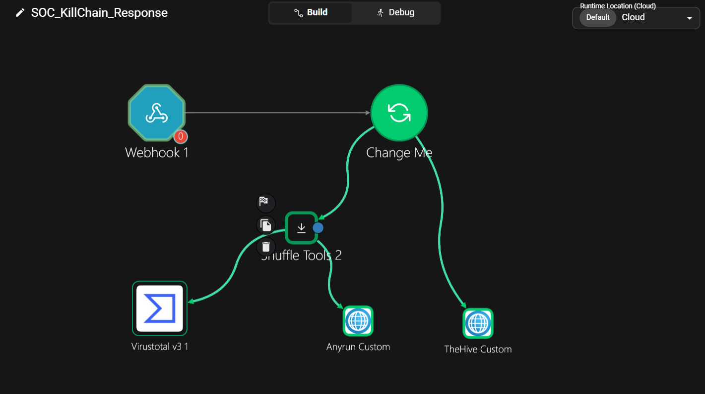
6. **Nghịêm thu đường ống Pipeline (Ghép Alert Wazuh & TheHive):**
   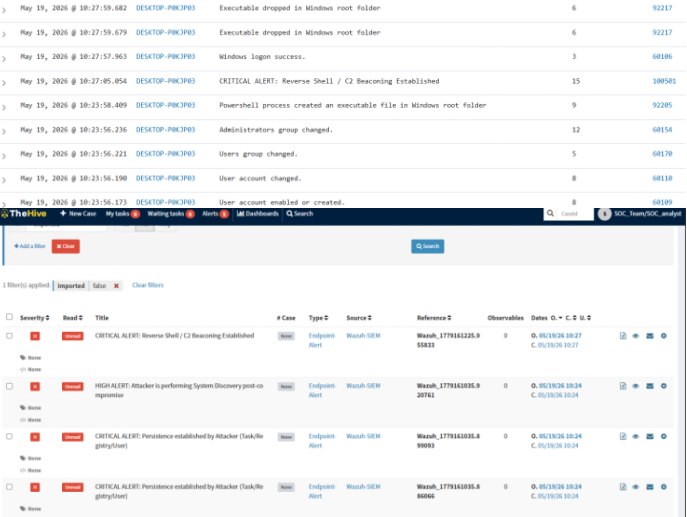

---

<b>🎣 GIAI ĐOẠN 2: TẤN CÔNG XÂM NHẬP & LEO THANG ĐẶC QUYỀN (UAC BYPASS)</b>

 

Giả lập chiến dịch Phishing bằng WinRAR SFX ngụy trang file CV. Đóng vai Attacker sử dụng Sliver C2 để thiết lập Session và bypass UAC chiếm quyền Administrator.

1. **Giao diện hòm thư nạn nhân nhận Mail Phishing CV độc hại:**
   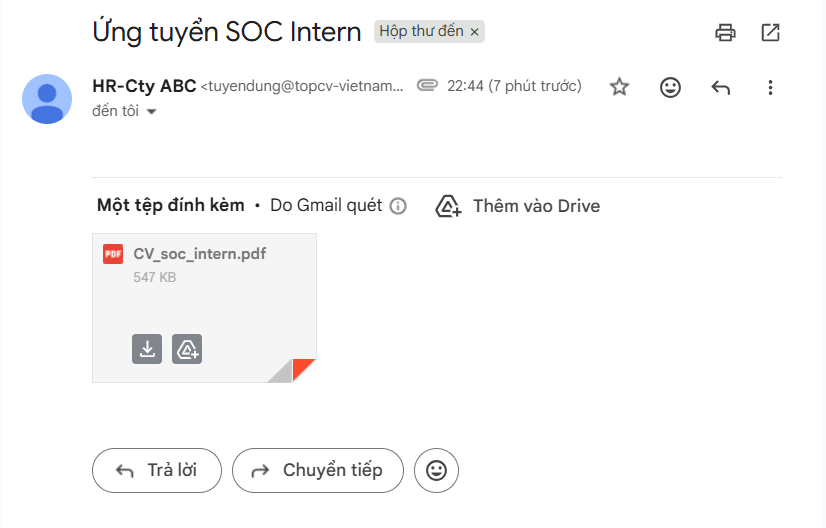
2. **File mã độc chứa mồi nhử Double Extension nằm trong máy nạn nhân:**
   
3. **Sliver C2 trên máy Kali nhận Session điều khiển ngược thành công:**
   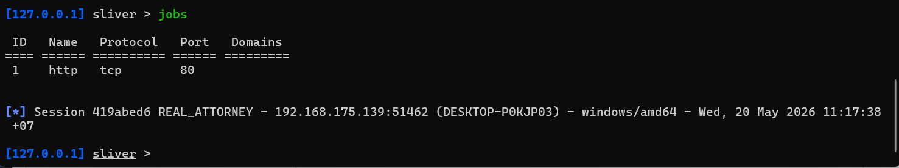
4. **Thực thi kỹ thuật Leo thang đặc quyền qua `fodhelper.exe`:**
   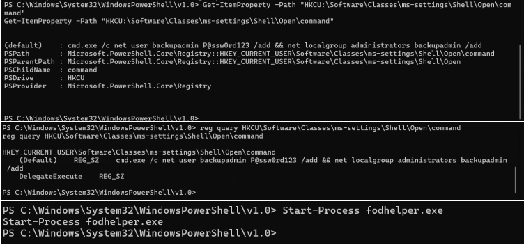
5. **Kiểm tra quyền tối cao của tài khoản độc hại `backupadmin` vừa tạo:**
   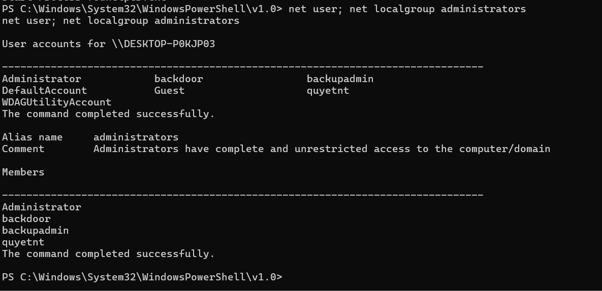
6. **Bảng Cảnh báo chuỗi Leo thang đặc quyền (Ghép Alert Wazuh & TheHive):**
   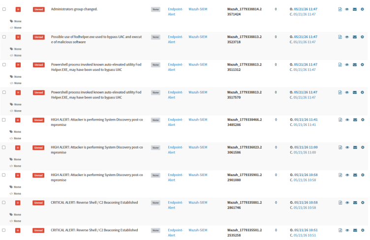

---

<b>📦 GIAI ĐOẠN 3: KHAI THÁC SÂU & TUỒN DỮ LIỆU NHẠY CẢM (DATA EXFILTRATION)</b>

 

Hacker tiến hành lục lọi hệ thống, trích xuất dữ liệu từ các ứng dụng ghi chú, cơ sở dữ liệu KeePass và thiết lập cơ chế duy trì truy cập (Persistence).

1. **Phát hiện vị trí lưu file nhạy cảm `plum.sqlite` (Sticky Notes):**
   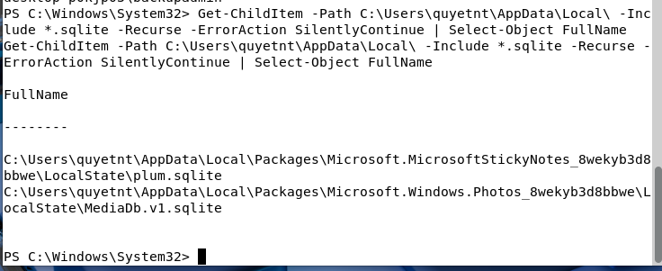
2. **Sử dụng SQLite3 bóc tách thông tin ghi chú quan trọng từ file cấu hình:**
   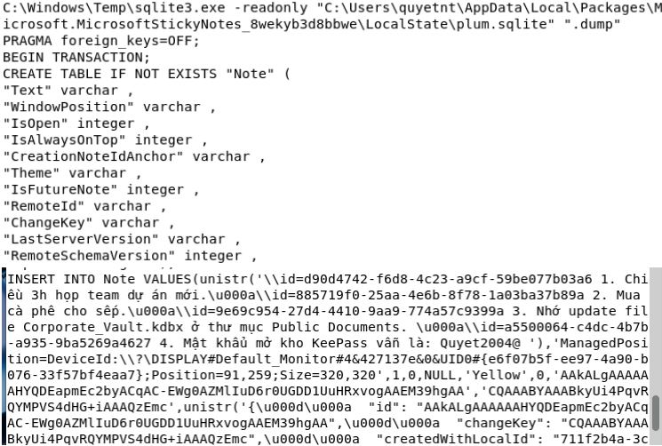
3. **Thực hiện tuồn file cơ sở dữ liệu mật khẩu `.kdbx` về máy Kali:**
   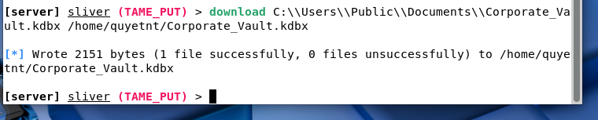
4. **Mở KeePass đọc toàn bộ thông tin tài khoản nhạy cảm của hệ thống:**
   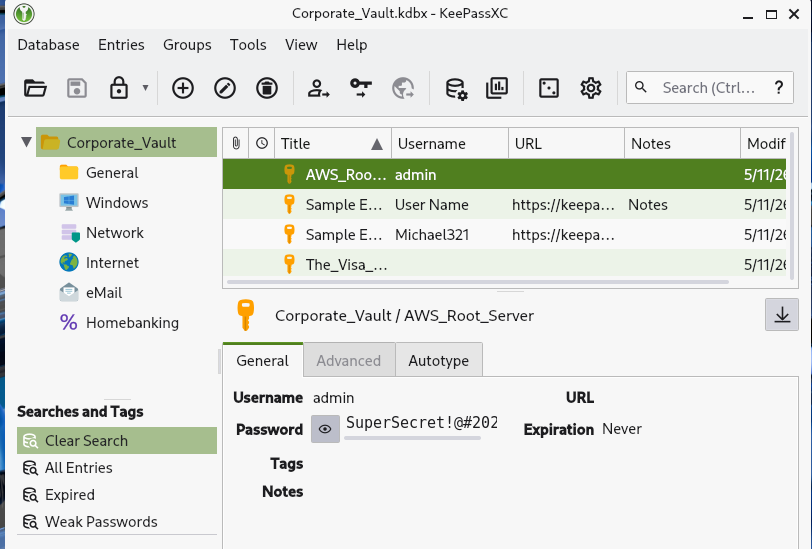
5. **Gõ lệnh Registry thiết lập Backdoor duy trì truy cập ngầm:**
   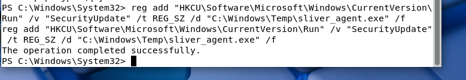
6. **Bảng Cảnh báo chuỗi hành vi Khai thác sâu (Ghép Alert Wazuh & TheHive):**
   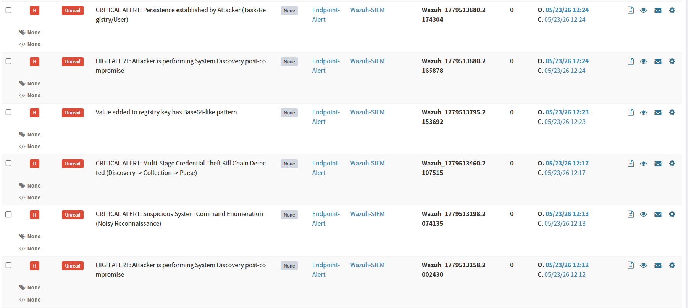

---

<b>🚨 GIAI ĐOẠN 4: ỨNG PHÓ KHẨN CẤP SOC & MỞ RỘNG TỰ ĐỘNG HÓA SOAR</b>

 

Trọng tâm phòng tuyến Blue Team: Điều tra hiện trường, thực hiện Eradication (Làm sạch), cấu hình Active Response chặn IP tự động và thiết kế các luồng SOAR nâng cao.

1. **Bảng tổng hợp hành động ứng phó (Cô lập mạng, Đóng băng user, Diệt tiến trình độc):**
   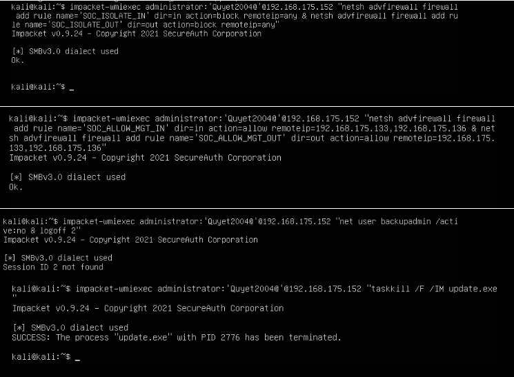
2. **Bằng chứng điều tra Alert trên TheHive (Bắt quả tang Bypass UAC và User quyetnt):**
   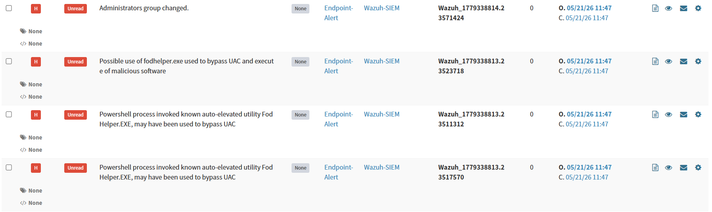
3. **Nghiệm thu kết quả khắc phục (Tước quyền thực thi, Xóa user backdoor, Xóa ổ bệnh CV):**
   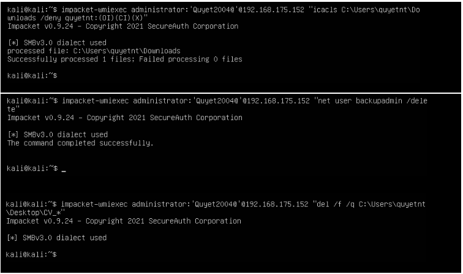
4. **Quét X-Ray kiểm tra Dịch vụ (Services) ẩn nấp ngầm:**
   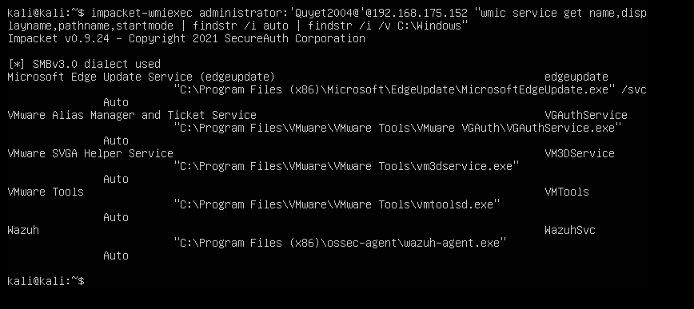
5. **Nghiệm thu rà quét Backdoor rớt lại (Ghép thư mục Startup ẩn và kết nối mạng ra ngoài):**
   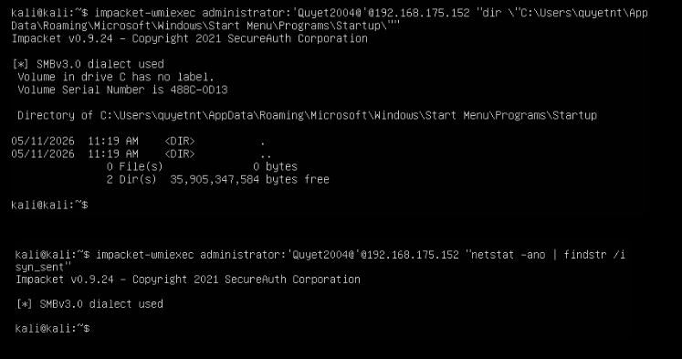
6. **Rà quét kiểm tra an toàn các khóa Registry và Schedule Tasks:**
   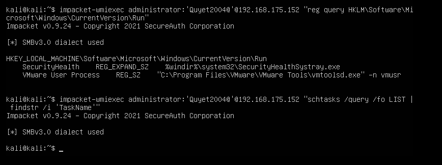
7. **Bổ sung Code cấu hình tự động block mạng 10 phút vào file `ossec.conf`:**
   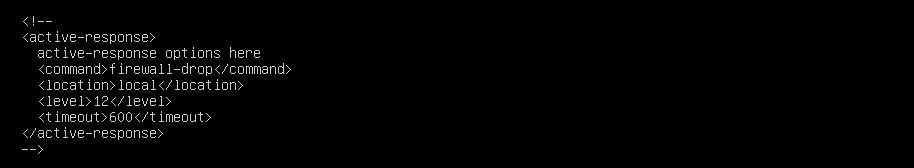
8. **Wazuh phát hiện hệ thống dính lỗ hổng bảo mật nghiêm trọng CVE-2026:**
   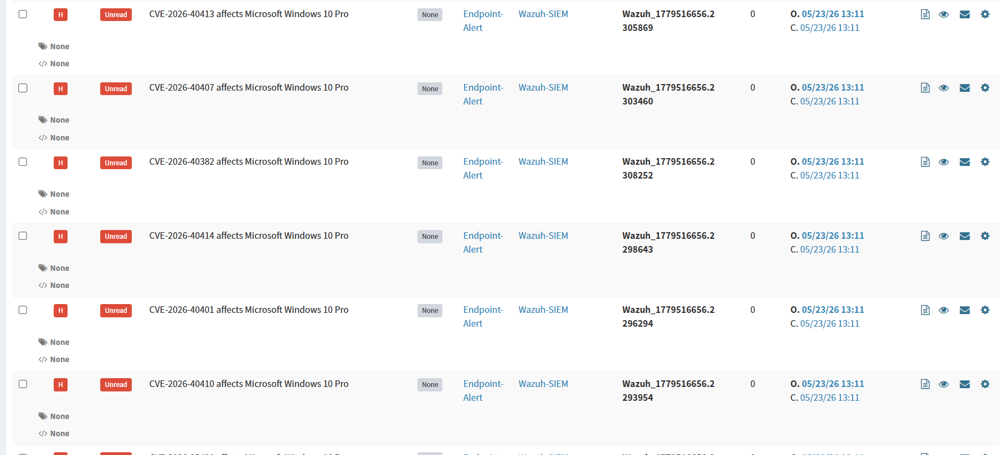
9. **Sơ đồ luồng SOAR thiết kế riêng cho việc phân loại và xử lý lỗ hổng CVE thông minh:**
   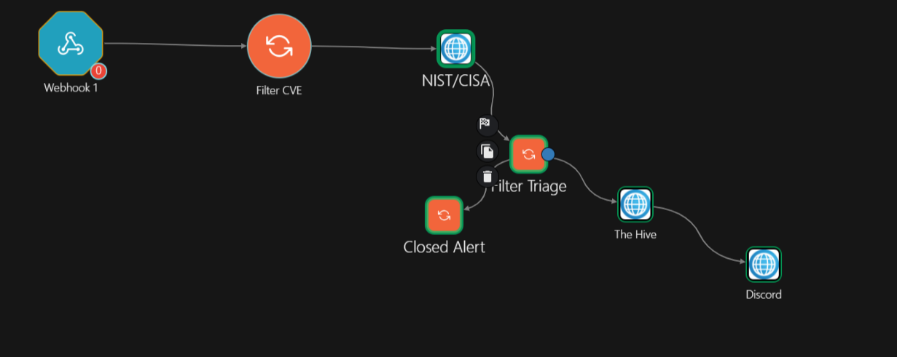
10. **Bản mở rộng luồng SOAR tự động phân tích mã độc (Workflow Extension - Tích hợp API VirusTotal & Any.Run):**
    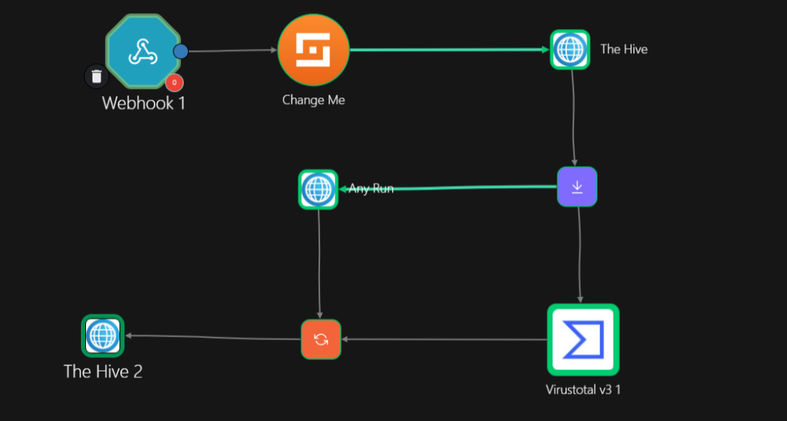

---
